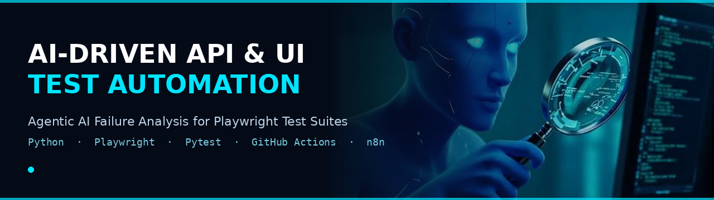
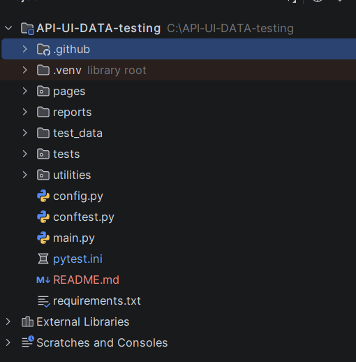
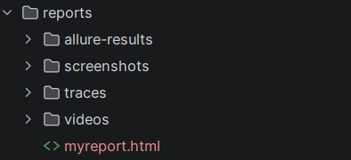
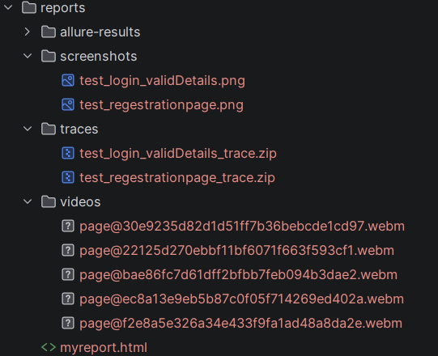
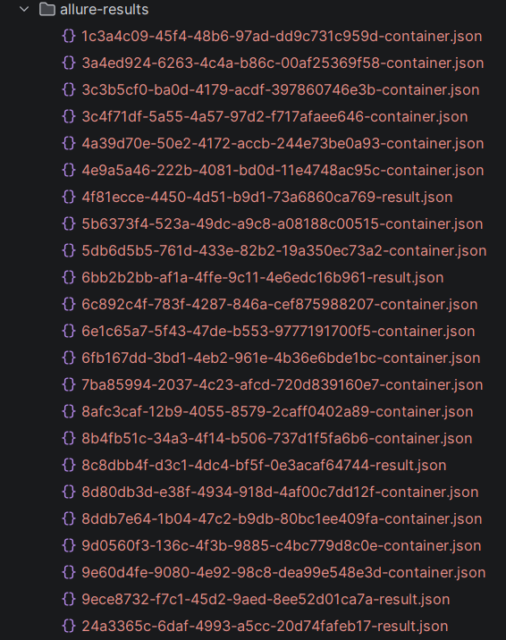
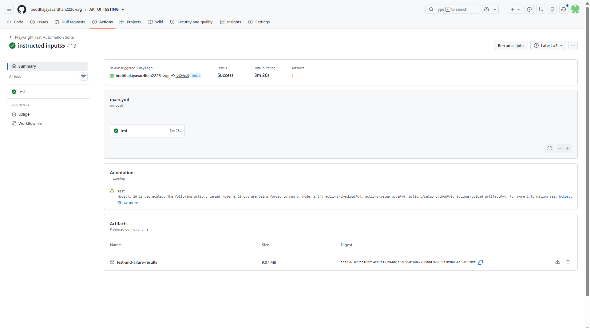
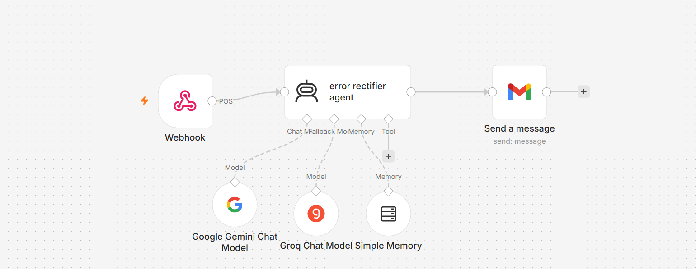
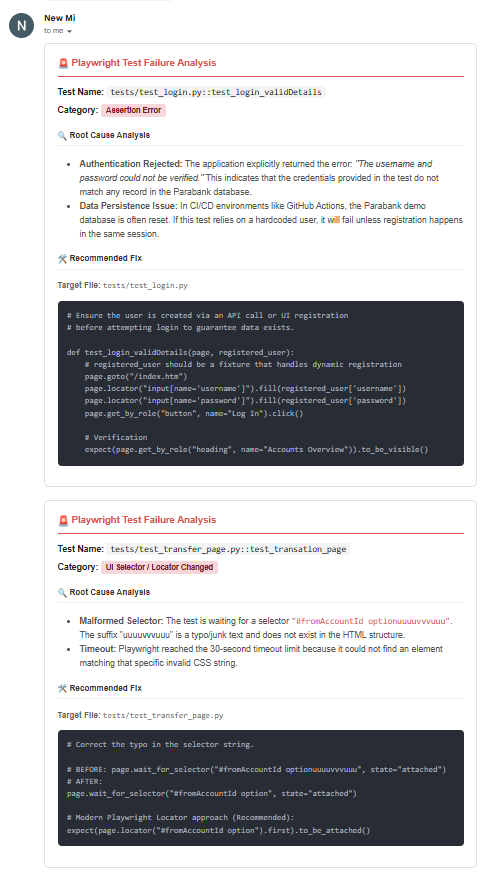

<div align="center">



**Agentic AI Failure Analysis for Playwright Test Suites | Python · Playwright · Pytest**

[](https://www.python.org/)
[](https://playwright.dev/python/)
[](https://docs.pytest.org/)
[](https://github.com/features/actions)
[](https://allurereport.org/)
[](https://n8n.io/)

</div>

---

## 📌 Overview

A Page Object Model based automation framework built for [ParaBank](https://parabank.parasoft.com/parabank), Parasoft's demo banking application. It covers UI and API testing, generates rich visual reports on every run, and  on any test failure  automatically triggers an AI agent that analyzes the stack trace and emails a root-cause report before the logs are even opened manually.

---

## ✨ Key Features

- **Page Object Model** where clean separation between test logic and page interactions
- **UI + API testing** in one framework, sharing the same fixtures and utilities
- **Data-driven testing** with JSON test data and the Faker library for dynamic, unique user data on every run
- **End-to-End flow coverage** where registration → login → fund transfer → transaction verification → logout
- **Multi-layer reporting** where Allure, self-contained HTML, Playwright traces, screenshots, and video, all captured automatically on failure
- **CI/CD pipeline** via GitHub Actions where runs on every push/PR, publishes artifacts
- **AI-powered failure analysis** where a custom n8n workflow (Google Gemini, with Groq as fallback) reads the failure logs and emails a structured root-cause + fix report, whether the run happens in CI or on a local machine
- **Retry logic & test ordering** for flaky-resistant, deterministic runs

---

## 🗂️ Project Structure

```
API-UI-DATA-testing/
├── .github/
│   └── workflows/
│       └── main.yml              # CI/CD pipeline definition
├── pages/                        # Page Object Model
│   ├── homepage.py
│   ├── regestration_page.py
│   ├── transfer_page.py
│   ├── AccountOverviewPage.py
│   ├── findTransationsPage.py
│   └── transationDetails.py
├── tests/                        # Test suite
│   ├── test_API.py
│   ├── test_regestrationPage.py
│   ├── test_login.py
│   ├── test_transfer_page.py
│   └── test_END_TO_END.py
├── utilities/
│   ├── to_read_json_data.py      # JSON data reader
│   └── utility_data.py           # Faker-based random data generator
├── test_data/
│   └── data.json                 # Static test data
├── reports/                      # Auto-generated on run
│   ├── allure-results/ & allure-report/
│   ├── screenshots/              # Captured on failure
│   ├── videos/                   # Captured on failure
│   └── traces/                   # Playwright trace files
├── config.py                     # Test credentials & config
├── conftest.py                   # Fixtures, hooks, reporting, AI trigger
├── pytest.ini                    # Pytest configuration
├── requirements.txt
└── README.md
```

<p align="center">
  
</p>

---

## 🧪 Test Suite

| Test File | Coverage | Order |
|---|---|---|
| `test_API.py` | API-level DB reset/init, registration, OpenAPI endpoint discovery | 1 |
| `test_regestrationPage.py` | UI user registration flow | 2 |
| `test_login.py` | Valid & invalid login scenarios | 3, 4 |
| `test_transfer_page.py` | Fund transfer between accounts | 5 |
| `test_END_TO_END.py` | Full journey: register → login → transfer → verify transaction → logout | 6 |

---

## ⚙️ Tech Stack

| Category | Tools |
|---|---|
| Language | Python 3.14 |
| Automation | Playwright (Sync API) |
| Test Runner | Pytest, pytest-playwright, pytest-order, pytest-rerunfailures |
| Test Data | Faker, JSON |
| Reporting | Allure, pytest-html, Playwright Tracing |
| CI/CD | GitHub Actions |
| AI Integration | n8n, Google Gemini, Groq (fallback), Gmail node |

---

## 🚀 Getting Started

**1. Clone the repository**
```bash
git clone https://github.com/buddhajayavardhan2226-svg/API_UI_TESTING.git
cd API_UI_TESTING
```

**2. Install dependencies**
```bash
pip install -r requirements.txt
playwright install
```

**3. Run the test suite**
```bash
pytest
```

Run a specific suite:
```bash
pytest tests/test_END_TO_END.py -v
```

---

## 📊 Reports & Artifacts

Every run generates the following, organized under `reports/`:

- **Allure Report** — interactive test report with steps, timings, and attachments
- **HTML Report** (`reports/myreport.html`) — self-contained, shareable summary
- **Screenshots** — auto-captured on failure (`reports/screenshots/`)
- **Videos** — auto-recorded on failure (`reports/videos/`)
- **Playwright Traces** — full trace timeline for debugging failures (`reports/traces/`)

<p align="center">
  
</p>

<p align="center">
  
</p>

<p align="center">
  
</p>

View the Allure report locally:
```bash
allure serve reports/allure-results
```

---

## 🔁 CI/CD Pipeline

Configured in `.github/workflows/main.yml`, the pipeline is triggered on every push and pull request to `main`/`master`:

1. Checkout code, set up Python & Node.js
2. Install dependencies and Playwright browsers
3. Run the full pytest suite (headed, with retries) inside the CI runner
4. Generate the Allure HTML report
5. Upload all reports, screenshots, videos, and traces as workflow artifacts
6. Trigger the AI failure-analysis webhook — always, regardless of pass/fail

<p align="center">
  
</p>

---

## 🤖 AI-Powered Failure Analysis

`conftest.py` aggregates every failed test's name, file path, and stack trace into a single payload and posts it to an **n8n** webhook at the end of the test session. This triggers identically whether the suite is run in **GitHub Actions** or on a **local machine**, since the hook lives in the test framework itself rather than the CI configuration.

<p align="center">
  
</p>

The n8n workflow:

1. Receives the consolidated failure report via webhook
2. Passes it to the **error rectifier agent**, backed by **Google Gemini** with **Groq** as a fallback model, and short-term memory for context across a run
3. Generates a structured root-cause analysis and a recommended fix
4. Emails the report via the Gmail node

**Demonstration run:** to validate the pipeline end-to-end, two tests were intentionally broken — `test_login.py::test_login_validDetails` (an incorrect password argument) and `test_transfer_page.py::test_transation_page` (a malformed CSS selector). The AI agent correctly diagnosed both failures and emailed a report identifying the exact cause and fix for each, without any manual log inspection.

<p align="center">
  
</p>

| Test | Root Cause Identified by AI | Fix Suggested |
|---|---|---|
| `test_login_validDetails` | Login rejected because credentials didn't match any record, likely due to the ParaBank demo database resetting in CI while the test relied on a hardcoded user | Register the user dynamically (via API or UI) immediately before login, instead of depending on a static account |
| `test_transation_page` | Selector `#fromAccountId optionuuuuvvvuuu` does not exist in the DOM because a typo caused Playwright to time out waiting for it | Correct the selector to `#fromAccountId option`, or use a resilient locator with `.first.to_be_attached()` |

---

## 👤 Author

**Jayavardhan**
QA / SDET | Automation Testing with Python & Playwright

[LinkedIn](https://www.linkedin.com/in/buddha-jayavardhan)
